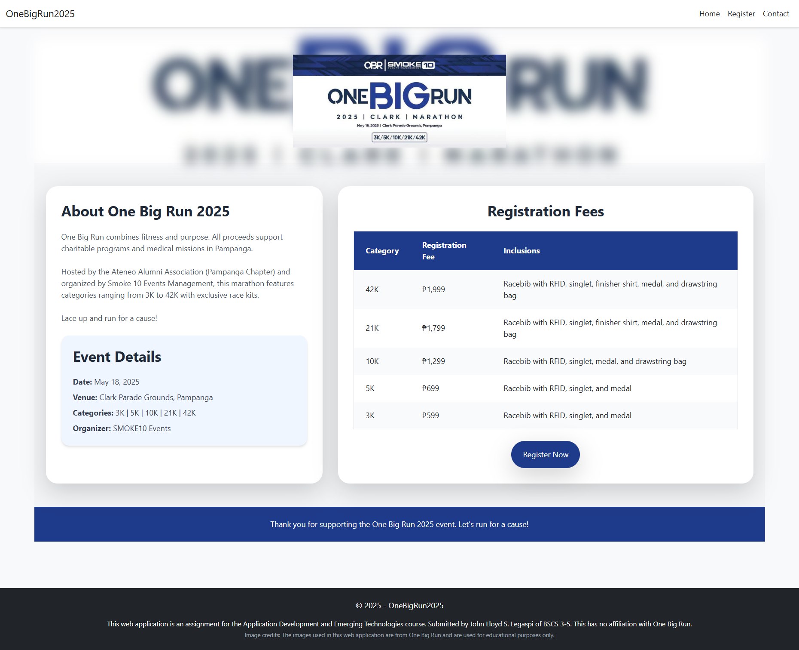
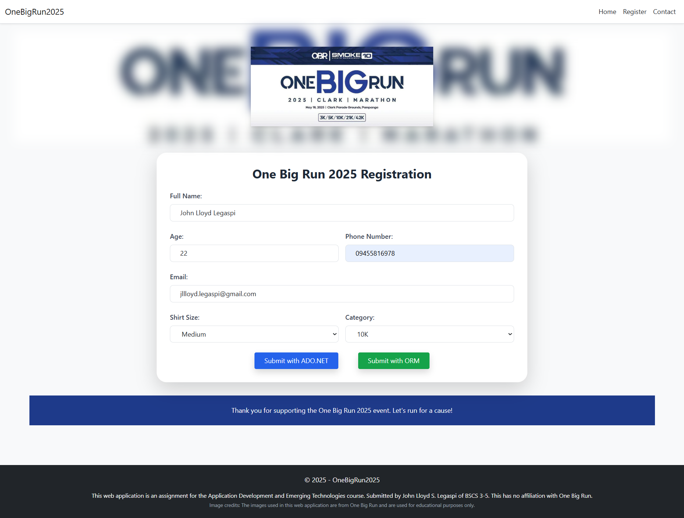
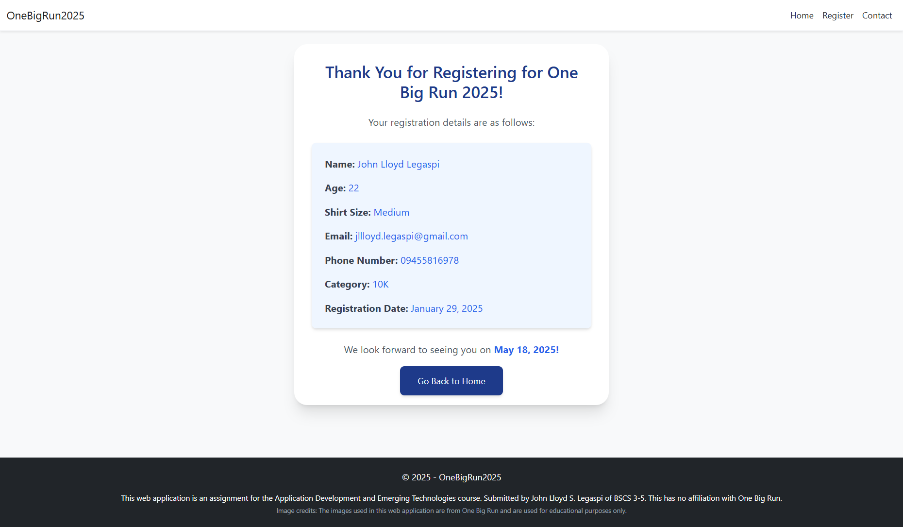

# One Big Run 2025 Fun Run Registration Application
  

This web application is an assignment for the COMP 019: Applications Development and Emerging Technologies course at the Polytechnic University of the Philippines. It was developed to apply the concepts of Model-View-Controller (MVC) architecture and database integration using two methods: ADO.NET and ORM (Entity Framework). The project uses Microsoft SQL Server 2022 and Visual Studio 2022 as its primary tools.

**Note:** This web application is purely educational and has no affiliation with the actual One Big Run event. Images used in the application are from One Big Run and are solely for educational purposes.

# Table of Contents
- [One Big Run 2025 Fun Run Registration Application](#one-big-run-2025-fun-run-registration-application)
  - [Technologies Used](#technologies-used)
  - [Features](#features)
  - [Screenshots](#screenshots)
  - [Database Integration](#database-integration)
  - [Image Credits](#image-credits)
  - [How to Run](#how-to-run)
    - [Prerequisites](#prerequisites)
    - [Steps](#steps)
  - [Disclaimer](#disclaimer)
  - [Contributing](#contributing)
  - [License](#license)
    
## Technologies Used

- Microsoft SQL Server 2022
- Visual Studio 2022
- ASP.NET Core MVC
- Entity Framework Core
- ADO.NET
- Tailwind CSS for front-end styling

## Features

- **Home Page:** Provides details about the One Big Run 2025 event.
- **Registration Form:** Users can register for the event by providing details such as name, age, email, phone number, shirt size, and race category.
- **Dual Registration Methods:**
  - ADO.NET for raw SQL operations.
  - Entity Framework for ORM-based operations.
- **Confirmation Page:** Displays a summary of the participant’s registration.
- **Contact Page:** Provides contact information for event inquiries.

## Screenshots

- **Home Page**
  

- **Registration Form**
  

- **Confirmation Page**
  

## Database Integration

This application demonstrates two methods of database interaction:

- **ADO.NET:** Direct SQL operations for data insertion.
- **Entity Framework (ORM):** Simplified database operations using DbContext.

## Image Credits

The images used in this web application are from One Big Run and are used for educational purposes only.

## How to Run

### Prerequisites
- Install Microsoft Visual Studio 2022 with ASP.NET and web development workload.
- Install Microsoft SQL Server 2022 and SQL Server Management Studio (SSMS).

### Steps

**How to Run the Application**
1. **Setup Database:** Create the necessary database and tables in Microsoft SQL Server 2022.
2. **Clone the Repository:** Open the project in Visual Studio 2022.
3. **Configure Connection Strings:** Update the connection string in `appsettings.json` for both ADO.NET and ORM methods.
4. **Run the Application:** Press F5 or click Run in Visual Studio.

## Disclaimer

This project is for educational purposes only as part of the course requirements for COMP 019 at the Polytechnic University of the Philippines. It has no affiliation with the One Big Run event.

## Contributing

We welcome contributions! Please follow these steps:
1. Fork the repository.
2. Create a new branch (`git checkout -b feature-branch`).
3. Make your changes and commit them (`git commit -m 'Add new feature'`).
4. Push to the branch (`git push origin feature-branch`).
5. Open a Pull Request.

## License

This project is licensed under the MIT License. See the [LICENSE](LICENSE) file for details.
